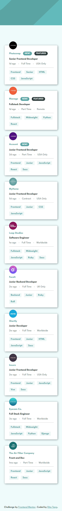
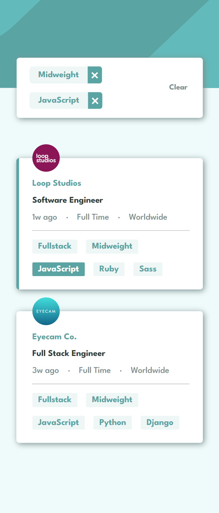
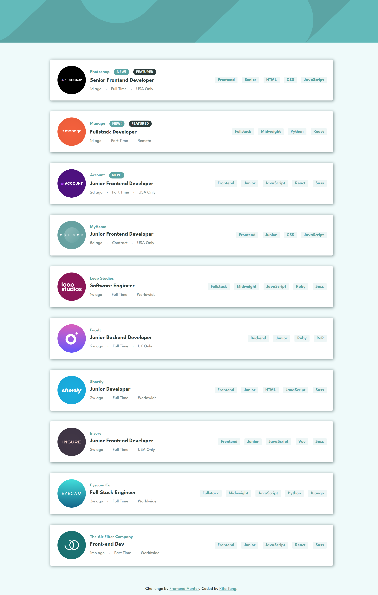
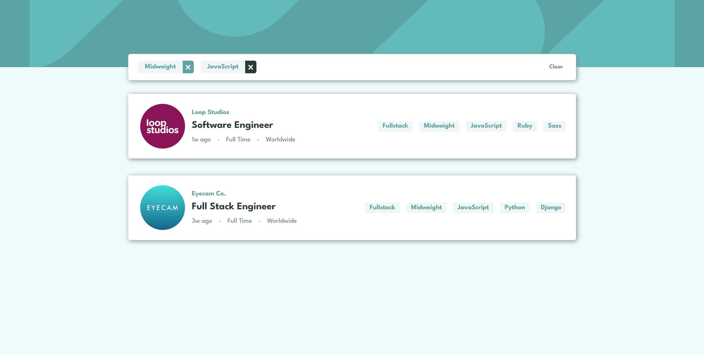

# Frontend Mentor - Job listings with filtering solution

This is a solution to the [Job listings with filtering challenge on Frontend Mentor](https://www.frontendmentor.io/challenges/job-listings-with-filtering-ivstIPCt).

## Table of contents

- [Overview](#overview)
  - [The challenge](#the-challenge)
  - [Screenshot](#screenshot)
  - [Links](#links)
- [My process](#my-process)
  - [Built with](#built-with)
  - [Continued development](#continued-development)

## Overview

### The challenge

The challenge is to build out the job listing page and get it looking as close to the design as possible. Users should be able to:

- View the optimal layout for the site depending on their device's screen size
- See hover states for all interactive elements on the page
- Filter job listings based on the categories

### Screenshot

<u>Mobile design</u>

<u>Desktop design</u>

  
  

 

### Links

- Solution URL: [Here](https://github.com/ritatanght/job-listings-with-filtering/)
- Live Site URL: [Here](https://ritatanght.github.io/job-listings-with-filtering/)

## My process

### Built with

- Semantic HTML5 markup
- CSS custom properties
- Flexbox
- Mobile-first workflow
- [React](https://reactjs.org/) - JS library

### Continued development

I chose to work on this project because I believe it is perfect for solidifying my React skills. Though I've only used some basic knowledge of React, practices like this help to build a solid fundamental for my future development in React. On the other hand, since I have chosen to store filters in an object variable, it unintentionally allows me to have a better understanding of and become more comfortable working with objects. I plan on doing several more projects using React before learning more advanced React knowledge.
